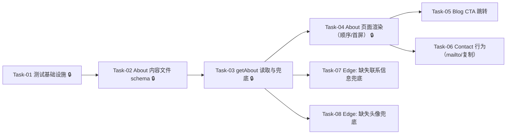

# About（关于我）— 开发任务计划

## 1. 任务概览

**总任务数**：8 个  
**预计总工时**：420 分钟（约 7 小时）  
**开发方法**：TDD — 每个任务按 RED → GREEN → REFACTOR 循环执行

**关键标注**：
- 🔒 阻塞任务：被多个任务依赖，建议优先完成
- ⚠️ 风险任务：技术难度高，可能需要额外时间

### 依赖关系图

### 可并行任务组

| 并行组 | 任务 | 说明 |
|--------|------|------|
| P-01 | Task-05、Task-06 | 都依赖页面主结构完成（Task-04），但彼此互不依赖 |
| P-02 | Task-07、Task-08 | 都依赖数据读取兜底完成（Task-03），但验证点独立 |

---

## 2. 开发任务

### 阶段 A：建立可测试的 About 交付链路

**阶段完成标准**：开发者可以在本地运行测试，用自动化方式验证 About 的渲染与兜底行为。

---

#### Task-01: 引入最小测试基础设施 🔒 ✅

**通俗解释**：后续每一步改动都能用“自动检查”证明页面没有坏掉，而不是靠肉眼猜。  
**做什么**：
- 引入 Vitest + jsdom（以及 React Testing Library）作为测试框架
- 增加 `npm run test` 脚本
- 建立 `tests/` 下的基础测试约定（例如 `tests/**/*.test.ts(x)`）

**涉及文件**：`package.json`、`vitest.config.ts`（新增）、`tests/setup.ts`（新增，可选）  
**参考**：技术方案 6（现有代码改动的测试承载） → AC-001~AC-010（为所有 AC 的可验证性提供基础）  
**依赖**：无  
**预估工时**：60 分钟  

**验证标准**：
- [ ] 运行 `npm run test` 能启动并完成一次空用例测试（exit code 0）
- [ ] 写一个最小 React 渲染测试（渲染 `
Hello
`）在 jsdom 环境通过
- [ ] 测试运行不依赖 `next dev`（纯测试命令可跑）

---

### 阶段 B：访客打开 About 能快速理解作者（首屏信息 + 固定模块顺序）

**阶段完成标准**：访客进入 `/about` 后能看到“头像/定位 + 简介 +（可选 Now）+ 技能 + 联系我 + 去博客”的结构，且页面具备基础 metadata。→ AC-001, AC-002, AC-003, AC-008, AC-009, AC-010

---

#### Task-02: 定义 About 内容文件与类型（JSON schema）🔒 ✅

**通俗解释**：About 的内容放在一个固定格式的文件里，字段少也没关系，但格式不会乱。  
**做什么**：
- 新增 `content/about/about.json` 作为内容源（可先填示例值）
- 新增 `src/modules/about/types.ts` 定义 `AboutContent` 类型（可选：再定义 `AboutNormalized`）
- 明确字段与可选字段：头像、name、tagline、bio、now、skills、contact、ctaBlog

**涉及文件**：`content/about/about.json`（新增）、`src/modules/about/types.ts`（新增）  
**参考**：技术方案 2（架构概览）/ 7（JSON vs Markdown 决策） → AC-002, AC-003, AC-005, AC-010  
**依赖**：Task-01  
**预估工时**：45 分钟  

**验证标准**：
- [ ] `AboutContent` 类型能表达“Now/头像/联系方式可缺失”的场景（可选字段）
- [ ] 新增的 `content/about/about.json` 在本地可被读取（后续任务会用到）
- [ ] `npm run typecheck` 通过

---

#### Task-03: 实现 `getAbout()` 读取与规范化兜底 🔒 ✅

**通俗解释**：不管 About 文件缺了哪些字段，页面都能拿到一份“可安全展示”的数据。  
**做什么**：
- 新增 `src/modules/about/getAbout.ts`
- 读取 `content/about/about.json` 并输出规范化结构：
  - 头像缺失：生成 `avatar: null` 或 `avatar.kind = 'placeholder'`
  - 联系方式缺失：生成 `contact: []` 并附带 `contactFallbackMessage`
  - Now 为空：约定为 `now: null`（页面隐藏 Now 模块）

**涉及文件**：`src/modules/about/getAbout.ts`（新增）  
**参考**：技术方案 5.1（兜底策略） → AC-006, AC-007, AC-010  
**依赖**：Task-02  
**预估工时**：75 分钟  

**验证标准**：
- [ ] 当 `about.json` 缺失 `avatar` 字段时，`getAbout()` 返回的数据能明确指示使用占位头像（不会抛异常）→ AC-007, AC-010
- [ ] 当 `about.json` 缺失所有联系渠道时，`getAbout()` 返回 `contactFallbackMessage`（不会返回无效链接）→ AC-006, AC-010
- [ ] 当 `now` 为空或缺失时，`getAbout()` 返回 `now = null`（用于页面隐藏）→ AC-010
- [ ] 以上三种情况都有对应的单元测试覆盖（输入 JSON → 输出断言）

---

#### Task-04: 改造 `/about` 页面：首屏信息 + 固定模块顺序 + metadata 🔒 ✅

**通俗解释**：访客打开 About 页，一眼就能看到“我是谁”和下一步该点哪里。  
**做什么**：
- 改造 `src/app/about/page.tsx`：
  - 调用 `getAbout()` 获取内容
  - 按 BR-002 顺序渲染模块：头像/定位 → 简介 → Now（可选）→ 技能 → 联系我 → 去博客
  - 渲染基础 SEO（页面 `metadata` 的 title/description）
  - 保持静态输出（延续当前 `dynamic = 'force-static'` 约定）

**涉及文件**：`src/app/about/page.tsx`（修改）  
**参考**：技术方案 2（架构）/ 6（改动点） → AC-001, AC-002, AC-003, AC-008, AC-009, AC-010  
**依赖**：Task-03  
**预估工时**：90 分钟  

**验证标准**：
- [ ] 访问 `/about` 时页面包含一个 `h1`，且首屏能找到姓名/定位与简介的关键文本（测试用例以渲染结果断言）→ AC-002
- [ ] 页面模块渲染顺序可被验证：在 DOM 中“简介区块”出现在“技能区块”之前，“联系我区块”出现在“去博客”之前 → AC-008
- [ ] 当 `now = null` 时，“Now”模块不渲染（页面仍完整可读）→ AC-010
- [ ] 页面存在可访问的站内导航入口（导航已在 `src/app/layout.tsx`，该任务需确保 `/about` 正常可达）→ AC-001, AC-009

---

### 阶段 C：访客能去博客、能联系我（并处理关键边界）

**阶段完成标准**：访客在 About 页可以一键去博客；也可以通过“联系我”直接触达或得到明确兜底提示；缺头像/缺联系信息不会让页面崩坏。→ AC-004~AC-007, AC-010

---

#### Task-05: 实现“去博客”CTA 链接

**通俗解释**：访客读完 About 后，可以立刻去看博客文章。  
**做什么**：
- 在 About 页“去博客”模块提供明确链接/按钮，指向 `/blog`

**涉及文件**：`src/app/about/page.tsx`（修改）  
**参考**：技术方案 6 / AC 覆盖表 → AC-004  
**依赖**：Task-04  
**预估工时**：30 分钟  

**验证标准**：
- [ ] 页面存在可点击元素（link/button）文本包含“博客/Blog/阅读”等语义
- [ ] 该元素的目标地址为 `/blog`（断言 `href`）→ AC-004

---

#### Task-06: 实现“联系我”可直接触达（mailto / 复制）

**通俗解释**：访客想联系你时，不需要猜怎么联系，点一下就能开始联系或拿到可复制信息。  
**做什么**：
- 定义 `contact` 渲染规则（至少支持 email）
- Email 渲染为 `mailto:` 链接（可选：旁边提供复制按钮，但不强制）

**涉及文件**：`src/app/about/page.tsx`（修改）、（可选）`src/shared/components/*`（新增/复用）  
**参考**：技术方案 4（无 API，mailto/复制）→ AC-005  
**依赖**：Task-04  
**预估工时**：45 分钟  

**验证标准**：
- [ ] 当 `contact` 中存在 email 时，页面渲染一个 `mailto:` 链接，且包含正确邮箱字符串 → AC-005
- [ ] 点击行为不依赖任何登录态或后端接口（测试断言为：链接存在且 href 以 `mailto:` 开头）→ AC-009

---

#### Task-07: Edge — 缺失联系信息的兜底提示

**通俗解释**：当你没有公开联系方式时，页面会明确告诉访客“目前暂无公开联系方式”，不会出现空白或坏链接。  
**做什么**：
- 使用 `getAbout()` 输出的 `contactFallbackMessage` 在页面“联系我”模块渲染提示文案
- 确保不渲染任何无效联系链接

**涉及文件**：`src/modules/about/getAbout.ts`（如需微调）、`src/app/about/page.tsx`（修改）  
**参考**：技术方案 5.1 → AC-006, AC-010  
**依赖**：Task-03, Task-04  
**预估工时**：30 分钟  

**验证标准**：
- [ ] 当 `contact = []` 时，页面渲染固定提示文案（包含“暂无公开联系方式”语义）→ AC-006
- [ ] 同场景下页面不渲染 `mailto:` 或其他联系链接 → AC-006, AC-010

---

#### Task-08: Edge — 缺失头像时的占位头像展示

**通俗解释**：就算没有头像，About 页也会用一个简洁占位图形保持版式体面。  
**做什么**：
- 当 `avatar` 缺失时，渲染占位头像（例如圆形底 + 首字母）
- 确保占位不会影响标题/简介的布局

**涉及文件**：`src/modules/about/getAbout.ts`（如需微调）、`src/app/about/page.tsx`（修改）  
**参考**：技术方案 5.1 → AC-007, AC-010  
**依赖**：Task-03, Task-04  
**预估工时**：45 分钟  

**验证标准**：
- [ ] 当 `avatar` 缺失时，页面仍渲染一个可识别的头像占位元素（例如 `data-testid="avatar"` 存在）→ AC-007
- [ ] 同场景下页面仍包含姓名/定位与简介文本（断言关键文本存在）→ AC-007, AC-010

---

## 3. AC 覆盖总表

| AC 编号 | 验收标准概述 | 承接任务 | 验证方式 |
|---------|-------------|---------|---------|
| AC-001 | 站点内可导航到 About | Task-04 | 组件测试：渲染后存在 `/about` 页面且可访问；人工点导航确认 |
| AC-002 | 首屏看到头像/定位与简介 | Task-04 | 组件测试：断言标题/简介/定位文本与头像区域存在 |
| AC-003 | Now 与技能可扫读 | Task-04 | 组件测试：skills 区块存在；now 存在时渲染/缺失时隐藏 |
| AC-004 | 引导去博客可用 | Task-05 | 组件测试：CTA 链接 `href="/blog"` |
| AC-005 | 联系我可直接触达 | Task-06 | 组件测试：存在 `mailto:` 链接（或复制按钮行为） |
| AC-006 | 联系信息缺失兜底 | Task-03、Task-07 | 单元测试 + 组件测试：缺联系时输出兜底 message 且页面展示提示、不展示链接 |
| AC-007 | 头像缺失兜底 | Task-03、Task-08 | 单元测试 + 组件测试：缺头像时输出占位标记且页面渲染占位头像 |
| AC-008 | 模块顺序固定 | Task-04 | 组件测试：断言关键区块在 DOM 顺序满足约定 |
| AC-009 | 公开可访问（无登录） | Task-04、Task-06 | 无鉴权代码；`next build` 通过；组件测试不依赖登录态 |
| AC-010 | 缺失可选信息仍可阅读 | Task-03、Task-04、Task-07、Task-08 | 单元测试 + 组件测试：缺字段不抛异常、页面关键内容仍存在 |

---

## 4. 完成定义

- [ ] Task-01~Task-08 的验证标准全部通过（测试 + typecheck + lint）
- [ ] AC 覆盖总表中每条 AC 的验证方式已执行并通过
- [ ] `npm run build` 通过，且 `/about` 在本地预览可正常访问与导航（手动验收 AC-001/004/005）

